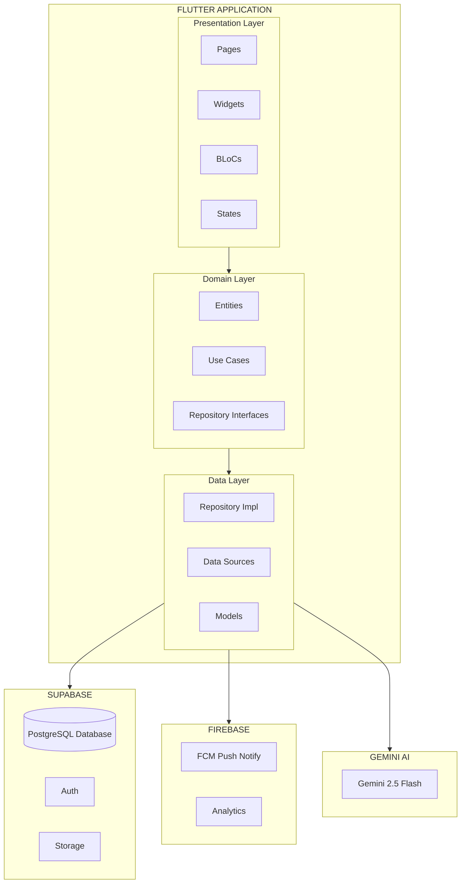
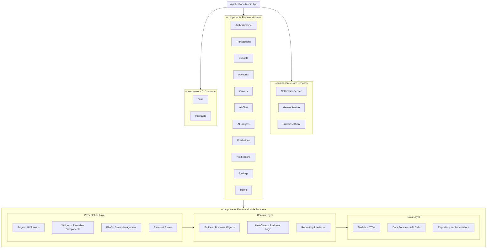
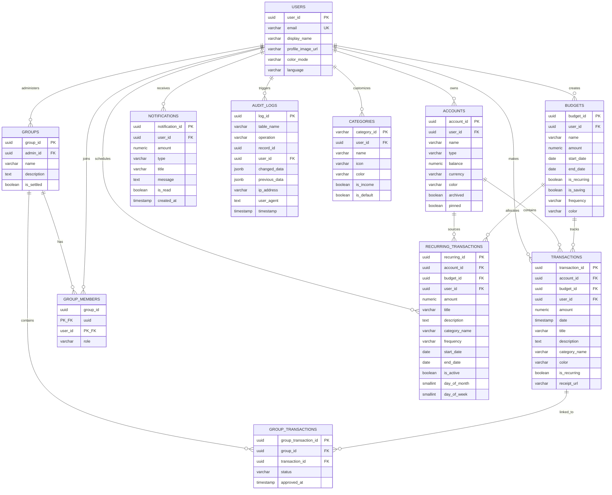

# Báo cáo Thiết kế & Phát triển - Ứng dụng Monie

## 2.8. Thiết kế & Phát triển (Design & Development)

### 2.8.1. System Architecture

#### Tổng quan kiến trúc hệ thống

Ứng dụng Monie được xây dựng theo mô hình kiến trúc Clean Architecture kết hợp với pattern BLoC (Business Logic Component) cho việc quản lý trạng thái. Đây là một kiến trúc phân lớp hiện đại, giúp tách biệt rõ ràng giữa giao diện người dùng, logic nghiệp vụ và tầng dữ liệu, từ đó đảm bảo khả năng mở rộng, bảo trì và kiểm thử dễ dàng.

Hệ thống được thiết kế theo mô hình client-server, trong đó ứng dụng Flutter đóng vai trò client kết nối với Supabase Backend-as-a-Service (BaaS) để xử lý xác thực, lưu trữ dữ liệu và quản lý file. Ngoài ra, hệ thống còn tích hợp Firebase Cloud Messaging cho push notification và Google Gemini AI cho các tính năng phân tích tài chính thông minh.

Kiến trúc tổng thể bao gồm ba tầng chính: Presentation Layer chịu trách nhiệm hiển thị giao diện và tương tác người dùng thông qua các Widget và BLoC; Domain Layer chứa các entity, repository interface và use case đại diện cho logic nghiệp vụ cốt lõi; và Data Layer xử lý việc giao tiếp với các nguồn dữ liệu bên ngoài thông qua các data source và model.

#### Sơ đồ kiến trúc tổng quan (High-level Architecture Diagram)



#### Sơ đồ thành phần UML (Component Diagram)



#### Bảng công nghệ sử dụng (Technology Stack Table)

| Danh mục                 | Công nghệ                   | Phiên bản  | Mục đích sử dụng                   |
| ------------------------ | --------------------------- | ---------- | ---------------------------------- |
| **Framework**            | Flutter                     | SDK ^3.7.2 | Cross-platform mobile development  |
| **Ngôn ngữ**             | Dart                        | 3.x        | Ngôn ngữ lập trình chính           |
| **State Management**     | flutter_bloc                | ^8.1.4     | Quản lý trạng thái ứng dụng        |
|                          | bloc                        | ^8.1.3     | Core BLoC library                  |
|                          | equatable                   | ^2.0.5     | Value equality cho entities        |
| **Dependency Injection** | get_it                      | ^7.6.7     | Service locator pattern            |
|                          | injectable                  | ^2.3.4     | Annotation-based DI                |
| **Backend & Database**   | supabase_flutter            | ^2.3.4     | Backend-as-a-Service (PostgreSQL)  |
|                          | sqflite                     | ^2.3.2     | Local SQLite database              |
| **AI Integration**       | google_generative_ai        | ^0.4.7     | Gemini AI API (phân tích chi tiêu) |
| **Push Notifications**   | firebase_core               | ^3.6.0     | Firebase initialization            |
|                          | firebase_messaging          | ^15.1.3    | FCM push notifications             |
|                          | flutter_local_notifications | ^18.0.1    | Local notifications                |
| **Analytics**            | firebase_analytics          | ^11.3.3    | User behavior analytics            |
| **UI Components**        | fl_chart                    | ^1.0.0     | Biểu đồ và đồ thị                  |
|                          | google_fonts                | ^6.2.1     | Typography                         |
|                          | flutter_svg                 | ^2.1.0     | Vector graphics                    |
|                          | percent_indicator           | ^4.2.3     | Progress indicators                |
|                          | flutter_markdown            | ^0.6.14    | Markdown rendering                 |
| **Utilities**            | dartz                       | ^0.10.1    | Functional programming (Either)    |
|                          | uuid                        | ^4.5.1     | Unique ID generation               |
|                          | intl                        | ^0.19.0    | Internationalization               |
|                          | shared_preferences          | ^2.5.3     | Local key-value storage            |
|                          | flutter_dotenv              | ^5.1.0     | Environment variables              |
|                          | timezone                    | ^0.9.4     | Timezone handling                  |

#### Tích hợp với hệ thống Monie hiện tại

Các tính năng mới được tích hợp seamlessly vào hệ thống Monie thông qua dependency injection và BLoC pattern. Cụ thể, ba tính năng AI mới (AI Chat, Spending Pattern Analysis, Spending Predictions) được đăng ký vào GetIt container và cung cấp dưới dạng BlocProvider trong widget tree. Các tính năng này tận dụng dữ liệu từ TransactionRepository và BudgetRepository hiện có để thực hiện phân tích, đảm bảo tính nhất quán dữ liệu và tránh duplicate code.

Tính năng Push Notification được tích hợp thông qua NotificationService singleton, kết nối với Firebase Cloud Messaging và local notifications. Service này được khởi tạo trong main.dart và được inject vào các BLoC cần thiết như GroupBloc và TransactionBloc để gửi thông báo khi có sự kiện quan trọng (budget exceeded, group transaction pending, etc.).

---

### 2.8.2. Database Schema & ERD

#### Tổng quan cơ sở dữ liệu

Hệ thống sử dụng PostgreSQL thông qua Supabase làm cơ sở dữ liệu chính. Database được thiết kế theo nguyên tắc normalization để tránh data redundancy, đồng thời áp dụng Row Level Security (RLS) để đảm bảo mỗi user chỉ có thể truy cập dữ liệu của chính mình. Hệ thống bao gồm 11 bảng chính phục vụ cho các chức năng quản lý tài chính cá nhân, chi tiêu nhóm, và thông báo.

#### SQL Scripts cho các bảng mới (3 New Tables)

Ba bảng được bổ sung để hỗ trợ các tính năng mới của ứng dụng bao gồm: **notifications** (thông báo đẩy và cảnh báo), **recurring_transactions** (giao dịch định kỳ), và **audit_logs** (ghi log thay đổi dữ liệu).

**1. Bảng Notifications (Thông báo)**

```sql
-- Bảng notifications lưu trữ thông báo cho người dùng
CREATE TABLE notifications (
    notification_id UUID PRIMARY KEY DEFAULT gen_random_uuid(),
    user_id UUID NOT NULL REFERENCES users(user_id) ON DELETE CASCADE,
    amount DECIMAL(15, 2),
    type TEXT NOT NULL CHECK (type IN ('group_transaction', 'group_settlement',
                                        'budget_alert', 'general')),
    title TEXT NOT NULL,
    message TEXT,
    is_read BOOLEAN DEFAULT FALSE,
    created_at TIMESTAMP WITH TIME ZONE DEFAULT TIMEZONE('utc', NOW())
);

-- Giải thích các cột:
-- notification_id: Khóa chính UUID tự động generate
-- user_id: Foreign key liên kết với bảng users, CASCADE khi xóa user
-- amount: Số tiền liên quan (nullable, dùng cho budget_alert)
-- type: Loại thông báo (group_transaction, group_settlement, budget_alert, general)
-- title: Tiêu đề thông báo
-- message: Nội dung chi tiết
-- is_read: Trạng thái đã đọc/chưa đọc
-- created_at: Thời gian tạo (UTC timezone)
```

**2. Bảng Recurring Transactions (Giao dịch định kỳ)**

```sql
-- Bảng recurring_transactions quản lý các giao dịch lặp lại
CREATE TABLE recurring_transactions (
    recurring_id UUID PRIMARY KEY DEFAULT uuid_generate_v4(),
    account_id UUID REFERENCES accounts(account_id) ON DELETE CASCADE NOT NULL,
    budget_id UUID REFERENCES budgets(budget_id) ON DELETE SET NULL,
    user_id UUID REFERENCES users(user_id) ON DELETE CASCADE NOT NULL,
    amount NUMERIC(15,2) NOT NULL,
    title VARCHAR(255) NOT NULL,
    description TEXT,
    category_name VARCHAR(100),
    color VARCHAR(30),
    frequency VARCHAR(20) NOT NULL,
    start_date DATE NOT NULL,
    end_date DATE,
    is_active BOOLEAN DEFAULT TRUE,
    day_of_month SMALLINT CHECK (day_of_month BETWEEN 1 AND 31),
    day_of_week SMALLINT CHECK (day_of_week BETWEEN 0 AND 6)
);

-- Giải thích các cột:
-- recurring_id: Khóa chính UUID
-- account_id: Tài khoản thực hiện giao dịch (CASCADE khi xóa)
-- budget_id: Ngân sách liên kết (SET NULL khi xóa budget)
-- user_id: Người dùng sở hữu (CASCADE khi xóa)
-- amount: Số tiền giao dịch (15 số, 2 decimal)
-- title, description: Thông tin mô tả
-- category_name, color: Phân loại và màu hiển thị
-- frequency: Tần suất (daily, weekly, monthly, yearly)
-- start_date, end_date: Khoảng thời gian hiệu lực
-- is_active: Trạng thái hoạt động
-- day_of_month: Ngày trong tháng (1-31) cho monthly
-- day_of_week: Ngày trong tuần (0-6, 0=Sunday) cho weekly
```

**3. Bảng Audit Logs (Nhật ký thay đổi)**

```sql
-- Bảng audit_logs ghi lại mọi thay đổi trong database
CREATE TABLE audit_logs (
    log_id UUID PRIMARY KEY DEFAULT uuid_generate_v4(),
    table_name VARCHAR(50) NOT NULL,
    operation VARCHAR(10) NOT NULL CHECK (operation IN ('INSERT', 'UPDATE', 'DELETE')),
    record_id UUID NOT NULL,
    user_id UUID REFERENCES users(user_id) ON DELETE SET NULL,
    changed_data JSONB,
    previous_data JSONB,
    ip_address VARCHAR(45),
    user_agent TEXT,
    timestamp TIMESTAMP WITH TIME ZONE DEFAULT CURRENT_TIMESTAMP
);

-- Giải thích các cột:
-- log_id: Khóa chính UUID
-- table_name: Tên bảng bị thay đổi
-- operation: Loại thao tác (INSERT/UPDATE/DELETE)
-- record_id: ID của bản ghi bị ảnh hưởng
-- user_id: Người thực hiện thay đổi
-- changed_data: Dữ liệu mới (JSONB format)
-- previous_data: Dữ liệu cũ trước khi thay đổi
-- ip_address: Địa chỉ IP client
-- user_agent: Thông tin browser/app
-- timestamp: Thời gian thực hiện
```

#### Indexes cho hiệu năng (Performance Indexes)

```sql
-- Indexes cho bảng notifications
CREATE INDEX idx_notifications_user_id ON notifications(user_id);
CREATE INDEX idx_notifications_created_at ON notifications(created_at DESC);
CREATE INDEX idx_notifications_is_read ON notifications(is_read);
CREATE INDEX idx_notifications_user_unread ON notifications(user_id, is_read)
    WHERE is_read = FALSE;  -- Partial index cho query thông báo chưa đọc

-- Indexes cho bảng recurring_transactions
CREATE INDEX idx_recurring_user_id ON recurring_transactions(user_id);
CREATE INDEX idx_recurring_account_id ON recurring_transactions(account_id);
CREATE INDEX idx_recurring_active ON recurring_transactions(is_active)
    WHERE is_active = TRUE;  -- Partial index cho giao dịch đang hoạt động

-- Indexes cho bảng audit_logs
CREATE INDEX idx_audit_table_name ON audit_logs(table_name);
CREATE INDEX idx_audit_timestamp ON audit_logs(timestamp DESC);
CREATE INDEX idx_audit_user_id ON audit_logs(user_id);
CREATE INDEX idx_audit_record_id ON audit_logs(record_id);
```

#### ERD Diagram (Entity Relationship Diagram)



#### Foreign Keys và Constraints

| Bảng                   | Foreign Key    | References                     | On Delete | Mô tả                              |
| ---------------------- | -------------- | ------------------------------ | --------- | ---------------------------------- |
| accounts               | user_id        | users(user_id)                 | CASCADE   | Xóa tài khoản khi xóa user         |
| budgets                | user_id        | users(user_id)                 | CASCADE   | Xóa budget khi xóa user            |
| transactions           | account_id     | accounts(account_id)           | SET NULL  | Giữ transaction, set account = NULL |
| transactions           | budget_id      | budgets(budget_id)             | SET NULL  | Giữ transaction, set budget = NULL |
| transactions           | user_id        | users(user_id)                 | CASCADE   | Xóa transaction khi xóa user       |
| groups                 | admin_id       | users(user_id)                 | SET NULL  | Giữ group, set admin = NULL        |
| group_members          | group_id       | groups(group_id)               | CASCADE   | Xóa member khi xóa group           |
| group_members          | user_id        | users(user_id)                 | CASCADE   | Xóa member khi xóa user            |
| group_transactions     | group_id       | groups(group_id)               | CASCADE   | Xóa khi xóa group                  |
| group_transactions     | transaction_id | transactions(transaction_id)   | CASCADE   | Xóa khi xóa transaction            |
| notifications          | user_id        | users(user_id)                 | CASCADE   | Xóa notification khi xóa user      |
| recurring_transactions | account_id     | accounts(account_id)           | CASCADE   | Xóa khi xóa account                |
| recurring_transactions | budget_id      | budgets(budget_id)             | SET NULL  | Giữ lại, set budget = NULL         |
| recurring_transactions | user_id        | users(user_id)                 | CASCADE   | Xóa khi xóa user                   |
| audit_logs             | user_id        | users(user_id)                 | SET NULL  | Giữ log, set user = NULL           |
| categories             | user_id        | users(user_id)                 | CASCADE   | Xóa category khi xóa user          |

**Check Constraints:**

- `notifications.type`: Chỉ cho phép 'group_transaction', 'group_settlement', 'budget_alert', 'general'
- `audit_logs.operation`: Chỉ cho phép 'INSERT', 'UPDATE', 'DELETE'
- `recurring_transactions.day_of_month`: Giá trị từ 1-31
- `recurring_transactions.day_of_week`: Giá trị từ 0-6 (0 = Sunday)

**Row Level Security (RLS) Policies:**

- Notifications: Users chỉ có thể SELECT/UPDATE/DELETE notifications của chính mình
- Categories: Users có thể SELECT categories của mình HOẶC global categories (user_id IS NULL)
- Tất cả các bảng khác đều có RLS policy tương tự để đảm bảo data isolation
